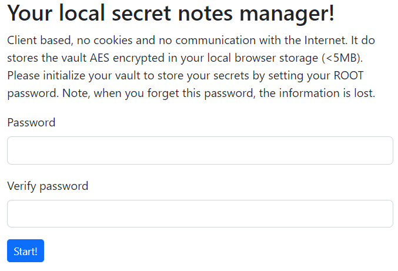
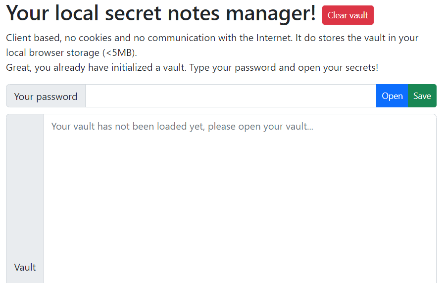
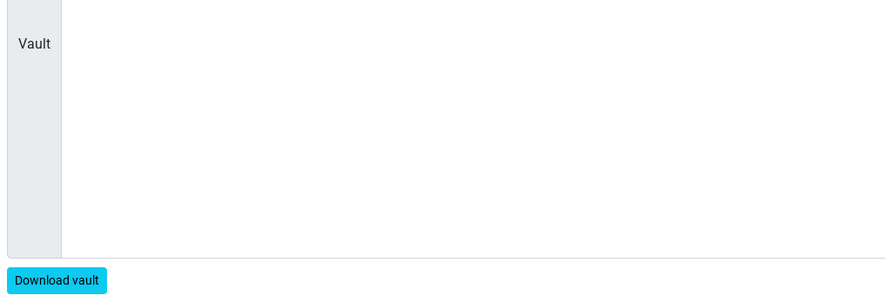

# Secret notes - secretnotes.html
A local browser based secret note manager. Using a master password, your notes are stored encrypted in the local storage of your browser. No cookies and secrets are communicated with the Internet.

When you do not want to rely on servers, services or third parties. This straigthforward password manager encrypts all your passwords and stores it locally at your browsers local storages. Everything is encrypted in that store. When you type in the password, the encrypted passwords will be visualized in the browser. No server communication, just on your local computer or browser. You can check the source code!

If loaded in your browser, you can use it without an active Internet connection. 

Use it at your own risk!

# Create your vault!
When you load the HTML page, it checks if you already have created a vault. It shows you the first page, where you can create a vault using a master password, when no vault have been created. See the figure below. Type in your password twice and press Start!

# Using your vault!
When a vault has been created, you land on the page that you can use your vault. Note that your vault has not been opened yet. Opening and saving your vault requires everytime your password. The figure below shows the page and the sections describe how it works.

## Opening your vault
Type in your password and click on the blue 'Open' button. If the password is correct, your secret notes are displayed in the text area.

## Saving your vault
When you have made changes to your vault. Type in your password and click on the green button 'Save'. Your changes are saved to the vault.

## Clear your vault
Clicking on the red button 'Clear vault' at the top of the page, will clear your vault. This is a destructive operation that deletes all the information stored in the local storage of your browser. Note, that this information cannot be retrieved anymore and that you will lose all your secret notes after executing this function.

## Download your vault
You can also download your encrypted vault. This cannot be read. The file can be stored anywhere and transferred to another computer if required. I have the file on my personal USB stick, so I am able to see the secret notes on any computer with a browser that is HTML5 enabled. The figure below shows the button 'Download vault' at the bottom of the page.

## Load yout vault
When you have cleared your vault or you just use another browser, you can load a vault file. This file is read and the encrypted contents is stored in the local storage. When loaded, you are able to open the secret notes and add secret notes.

# Usage
You can use this secret notes manager, by copying the ``secretnotes.html`` to your desktop for example. When you need the secretnotes, you simply open this local web page and you can use your secret notes in your browser.

# Libaries used
The following libraries are used and loaded from the Internet. All files will be checked on integrity before used.
* Bootstrap
* jQuery
* CryptoJS

# Security
The password that is used is converted to a strong key first. Using this retrieved key, all information is encrypted using AES with a minimal key length of 256 bits. At this moment, this is sufficient encryption to store secrets. Whenever someone is able to retrieve the encrypted data, it requires at least 70.000.000.000.000.000.000.000.000 years to crack your secrets.

Source wiki: https://en.wikipedia.org/wiki/Advanced_Encryption_Standard
> The design and strength of all key lengths of the AES algorithm (i.e., 128, 192 and 256) are sufficient to protect classified information up to the SECRET level. TOP SECRET information will require use of either the 192 or 256 key lengths. The implementation of AES in products intended to protect national security systems and/or information must be reviewed and certified by NSA prior to their acquisition and use.

Source Ubiqsecurity: https://www.ubiqsecurity.com/128bit-or-256bit-encryption-which-to-use/
> As a result, a brute force attack against an AES-256 key is much harder than against an AES-128 key. However, even a 128-bit key is secure against attack by modern technology. At its peak, the Bitcoin network – arguably the largest modern use of computational power for cryptography – performed approximately 150*10^18≈2^67 operations per second. Assuming that these operations are of equal difficulty to a brute force attack, it would take the Bitcoin network over 70,000,000,000,000,000,000,000,000 years to crack a single AES-128 key.
